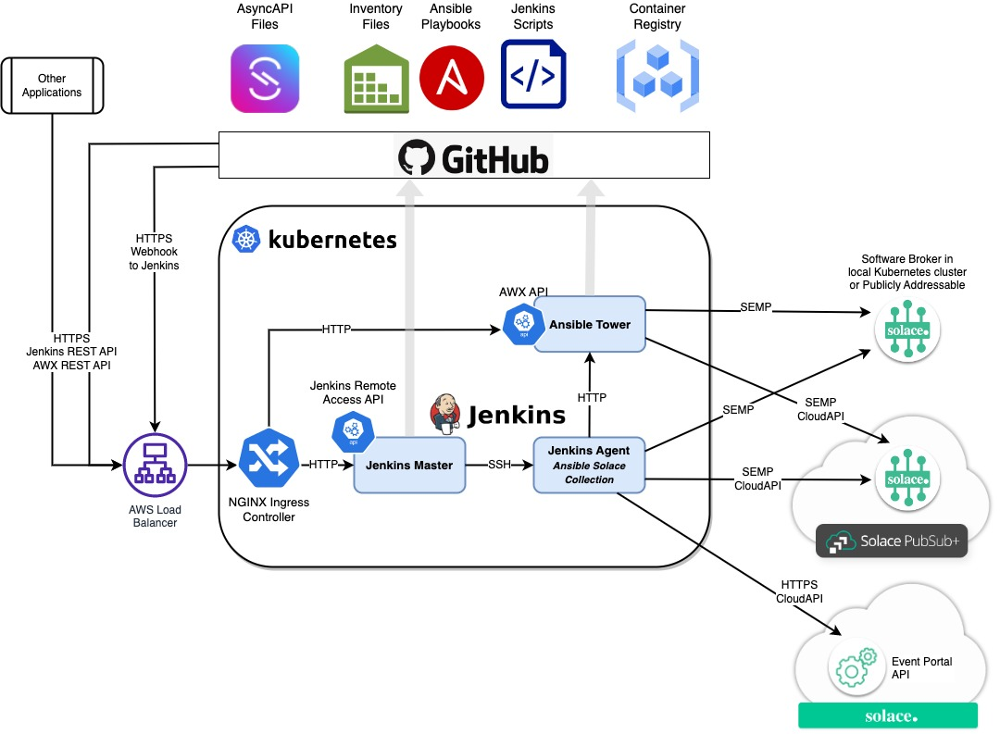
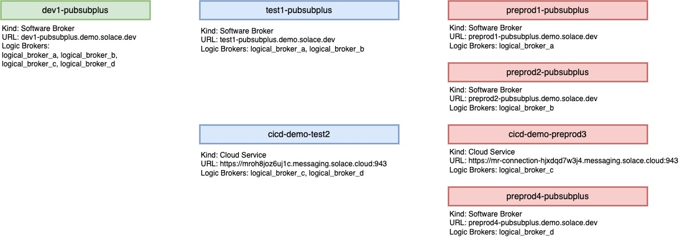
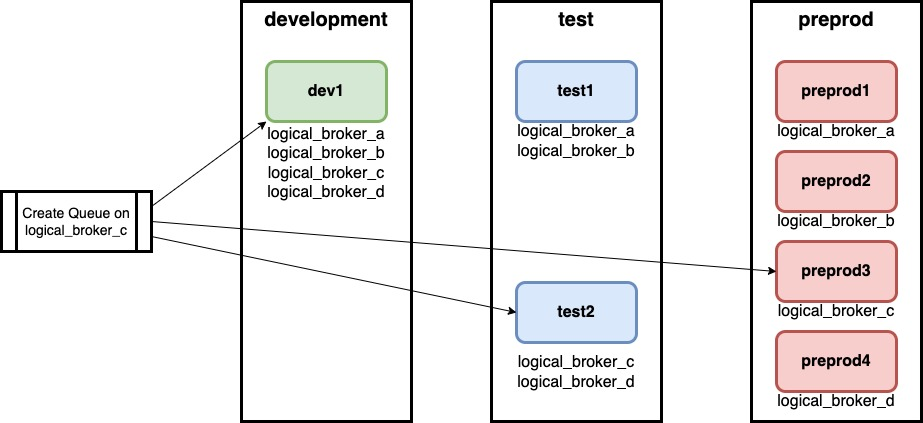

# Readme

## CI/CD Demo Tools components
- AWX (Ansible Tower open-source version)
- Jenkins
- Solace PubSub+ Brokers
- Kubernetes Ingress

## CI/CD Demo Tools Architecture Overview

### Source Diagrams
[Conceptual Architecture Diagram Source](https://app.diagrams.net/#G1qsAfy3DZwqaD71AB2jaAQ87Ssd9CBvVj)

## Pub-Sub+ Brokers

Note the logical and physical broker details.

## Logical Brokers
Logical brokers are labels given to physical brokers for deployment. The purpose is to provide a consistent name for brokers regardless of the environment. These labels exist in all environments. A logical broker lable may be assigned to multiple physical brokers.

